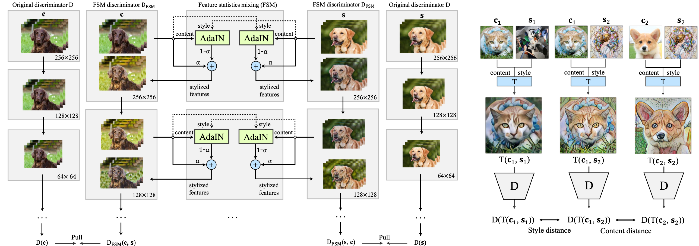
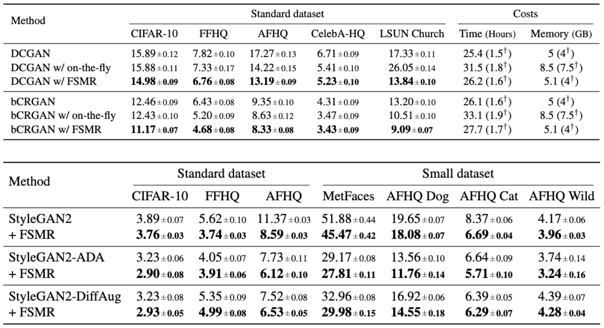
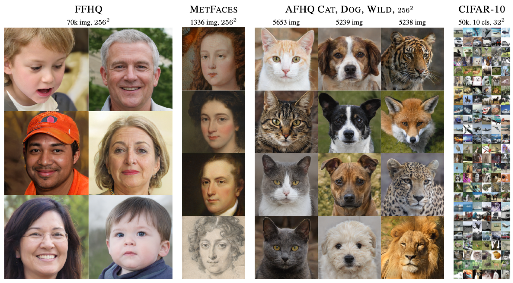

## FSMR &mdash; Official TensorFlow Implementation [[Paper]](https://arxiv.org/abs/2112.04120)
### : Feature Statistics Mixing Regularization for Generative Adversarial Networks (CVPR 2022)
> #### Authors: [Junho Kim<sup>1</sup>](https://github.com/taki0112), [Yunjey Choi<sup>1</sup>](https://github.com/yunjey), [Youngjung Uh<sup>2&dagger;</sup>](https://sites.google.com/site/youngjunguh)
> <sup>1</sup> <sub>NAVER AI Lab</sub> <sup>2</sup> <sub>Yonsei University</sub>
> <sup>&dagger;</sup> <sub> Corresponding author </sub>

<div align="center">
  
</div>

> **Abstract** *In generative adversarial networks, improving discriminators is one of the key components for generation performance. As image classifiers are biased toward texture and debiasing improves accuracy, we investigate 1) if the discriminators are biased, and 2) if debiasing the discriminators will improve generation performance. Indeed, we find empirical evidence that the discriminators are sensitive to the style (e.g., texture and color) of images.* ***As a remedy, we propose feature statistics mixing regularization (FSMR) that encourages the discriminator's prediction to be invariant to the styles of input images.*** *Specifically, we generate a mixed feature of an original and a reference image in the discriminator's feature space and we apply regularization so that the prediction for the mixed feature is consistent with the prediction for the original image. We conduct extensive experiments to demonstrate that our regularization leads to reduced sensitivity to style and consistently improves the performance of various GAN architectures on nine datasets. In addition, adding FSMR to recently-proposed augmentation-based GAN methods further improves image quality.*

### Usage
```python
# N: batch size, H: height, W: width, C: channels
def FSM(x, y, alpha, eps=1e-5):
    x_mu, x_var = tf.nn.moments(x, axes=[1,2], keepdims=True) # Nx1x1xC
    y_mu, y_var = tf.nn.moments(y, axes=[1,2], keepdims=True) # Nx1x1xC
    
    # normalize
    x_norm = (x - x_mu) / tf.sqrt(x_var + eps)
    
    # de-normalize
    x_fsm = x_norm * tf.sqrt(y_var + eps) + y_mu
    
    # combine
    x_mix = alpha * x + (1 - alpha) * x_fsm
    
    return x_mix # NxHxWxC

def discriminator(img, use_fsmr=False):
    # layers: conv, bn, actv, ..., fc -> discriminator layers
    
    x = img # NxHxWxC
    indices = tf.range(tf.shape(x)[0])
    shuffle_indices = tf.random.shuffle(indices)
    alpha = tf.random.uniform(shape=[], minval=0.0, maxval=1.0)
    
    for layer in layers:
        x = layer(x)
        if use_fsmr and layer.name == 'conv':
            y = tf.gather(x, shuffle_indices)
            x = FSM(x, y, alpha)
        
    return x # Nx1
	
def FSMR(real_img, fake_img, use_fsmr=True):
    real_logit = discriminator(real_img) # Nx1
    fake_logit = discriminator(fake_img) # Nx1
    
    if use_fsmr:
    	real_logit_mix = discriminator(real_img, use_fsmr) # Nx1
    	fake_logit_mix = discriminator(fake_img, use_fsmr) # Nx1
    	fsmr_loss = l2_loss(real_logit, real_logit_mix)
    	fsmr_loss += l2_loss(fake_logit, fake_logit_mix) # optional
    	fsmr_loss *= 1 # weight for fsmr
    else:
        fsmr_loss = 0

    return fsmr_loss

total_loss = adv_loss + fsmr_loss
```
### Train
#### StyleGAN2 w/ FSMR
```
> python train.py --mix=1 --mix_weight=0.05 --aug=noaug --mirror=1 
--outdir=training-runs --gpus=8 --res=256 --cfg=paper256 --data=./datasets/ffhq
```

#### ADA w/ FSMR
```
> python train.py --mix=1 --mix_weight=0.05
--outdir=training-runs --gpus=8 --res=256 --cfg=paper256 --data=./datasets/ffhq
```

#### DiffAug w/ FSMR
```
> python train.py --mix=1 --mix_weight=0.05 --diffaug=1
--outdir=training-runs --gpus=8 --res=256 --cfg=paper256 --data=./datasets/ffhq
```

### Results
#### Quantitative results
<div align="center">
  
</div>

#### Qualitative results
<div align="center">
  
</div>

### Citation
```bibtex
@inproceedings{kim2021feature,
  title={Feature Statistics Mixing Regularization for Generative Adversarial Networks},
  author={Kim, Junho and Choi, Yunjey and Uh, Youngjung},
  booktitle={CVPR},
  year={2022}
}
```

### Reference
This code is mainly built upon [StyleGAN2-ada](https://github.com/NVlabs/stylegan2-ada) and use [DiffAug](https://github.com/mit-han-lab/data-efficient-gans).

### License

Licensed under NVIDIA Source Code License for StyleGAN2 with Adaptive Discriminator Augmentation (ADA) as same as [StyleGAN2-ada](https://github.com/NVlabs/stylegan2-ada)
